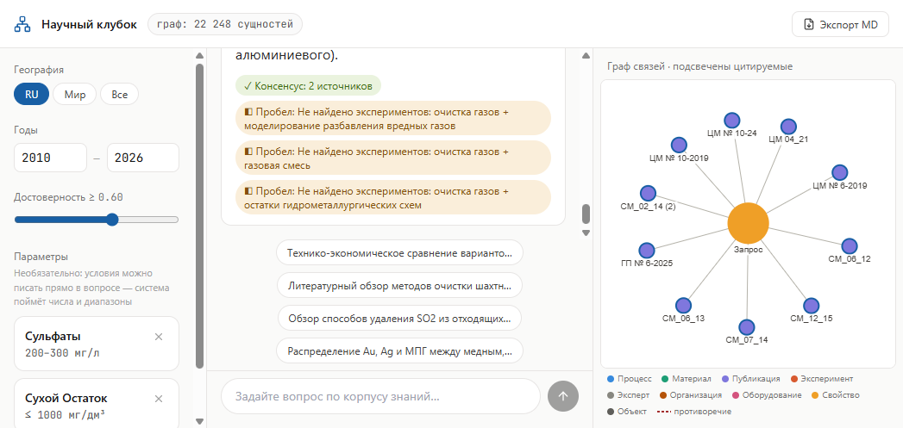

# Научный клубок

Граф знаний + гибридный GraphRAG-поиск по R&D-корпусу горно-металлургической отрасли.

[Живое демо](http://<VM_IP>) · [Видео](<VIDEO_URL>) · [Презентация](<PRES_URL>)

## Попробовать за 30 секунд

Откройте [демо](http://<VM_IP>) (локально: http://localhost:5173) и вставьте один из запросов:

```
Обзор способов удаления SO2 из отходящих газов металлургических предприятий мира
```

```
Распределение Au, Ag и МПГ между медным, никелевым штейном и шлаком по зарубежным источникам последних лет
```

```
Литературный обзор методов очистки шахтных вод горно-рудных предприятий цветной металлургии. Отечественная и мировая практика
```



## Что умеет

- Извлечение сущностей и числовых ограничений из PDF/DOCX/PPTX (RU/EN) с LLM-валидацией.
- Граф Neo4j: каждый факт с провенансом (`source_doc`, `confidence`, `geography`, `year`).
- Гибридный поиск: вектор (bge-m3) + text2cypher с числовыми фильтрами, слияние RRF.
- Синтез литобзора с inline-цитатами `[doc:…]` и уровнем достоверности по источникам.
- Детекция противоречий (рёбра `contradicts`) и пробелов знаний (отсутствие Experiment-связей).
- Открытие первоисточника в один клик из ответа или узла графа.

## Архитектура

```
data/raw (PDF/DOCX/PPTX)
   │ ① ingest/     — парсинг, чанкинг
   ▼
data/parsed/*.jsonl
   │ ② extraction/ — LLM: сущности, связи, числа
   ▼
data/extracted/*.jsonl
   │ ③ graph/      — Neo4j: загрузка, индексы, эмбеддинги
   ▼
Neo4j (fulltext + vector)
   │ ④ retrieval/  — bge-m3 + text2cypher → hybrid RRF
   ▼
   │ ⑤ synthesis/  — обзор, противоречия, пробелы
   ▼
   │ ⑥ api/ + frontend — чат, граф, фильтры, экспорт MD
```

Корпус проходит ingest → extraction → graph; запрос идёт параллельно через text2cypher (жёсткие фильтры, числа) и vector search, результаты сливаются RRF. Synthesis собирает обзор с цитатами, противоречиями и пробелами; API отдаёт `QueryResponse` с подграфом для визуализации. Контракты между модулями — только через `backend/app/schemas/`.

## Запуск

**Требования:** Python 3.11+, Docker, ~8 ГБ RAM (эмбеддинги на CPU).

**Шаг 0** — venv для Makefile-целей (`s3-pull`, `graph-reset`, `ref-queries`):

```bash
cd backend && python3 -m venv .venv && .venv/bin/pip install -e . && cd ..
```

**Настройка** — скопировать и заполнить:

```bash
cp .env.example .env
```

| Переменная | Зачем |
|------------|-------|
| `LLM_API_KEY`, `LLM_BASE_URL`, `LLM_MODEL` | DeepSeek: `https://api.deepseek.com/v1`, `deepseek-chat` (OpenAI-compatible) |
| `S3_ACCESS_KEY_ID`, `S3_SECRET_ACCESS_KEY`, `S3_BUCKET` | Скачать готовый корпус из Yandex Object Storage — без ключей граф будет пустым |
| `NEO4J_PASSWORD` | Должен совпадать с `NEO4J_AUTH` в docker-compose |
| `FEATURE_GRAPH`, `FEATURE_SYNTHESIS` | `true` — полный ответ с графом и LLM-синтезом |

**3 команды:**

```bash
cp .env.example .env   # заполнить таблицу выше
docker compose up -d
make s3-pull && make graph-reset
```

UI: http://localhost:5173 · API health: http://localhost:8001/api/health

Проверка retrieval: `make ref-queries` — 4 эталонных запроса, отчёт в `data/ref_runs/`.

`graph-reset` пересоздаёт граф и пересчитывает эмбеддинги чанков; на CPU занимает несколько минут.

Локальная vLLM вместо DeepSeek: `LLM_BASE_URL=http://vllm:8000/v1` + `make llm-up`.

## Стек

Python 3.11 / FastAPI · Neo4j 5 (APOC + GDS) · bge-m3 · React + TypeScript · DeepSeek API (заменяемый на локальную vLLM одной переменной `LLM_BASE_URL`).

## Осознанные компромиссы и roadmap

- **RBAC** — заглушка; роли и аудит действий не реализованы.
- **Консенсус** — бейдж на фронте по числу уникальных `doc_id` в цитатах, не отдельный аналитический шаг.
- **Журналы** — `journal_issue` исключён из extraction по умолчанию; полная обработка — вторая очередь.
- **Масштаб** — до ~1M сущностей: шардинг Neo4j по доменам, конфигурируемая онтология (JSON); в коде не реализовано.

Для разработки отдельных модулей — [`Makefile`](Makefile) и [`cursor-docs/docs/ARCHITECTURE.md`](cursor-docs/docs/ARCHITECTURE.md).
